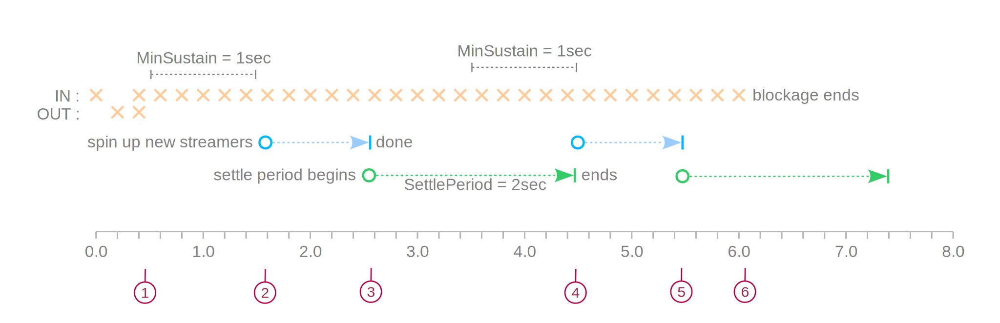

# Go APNS

:warning: **WORK IN PROGRESS** :warning:

Go APNS is a client for Apple Push Notification service over HTTP/2 protocol done "the Go way".

[](https://travis-ci.org/baobabus/go-apns)
[](https://godoc.org/github.com/baobabus/go-apns/apns2)

## Features

- Designed to communicate with Apple Push Notification service over HTTP/2 protocol
- Processes push requests asynchronously: just write your requests to a channel
- Notifies about push results asynchronously: just receive on the callback channel
- Automatically scales up processing pipeline as the load increases
- Allows full control of the scaling process and connection handling
- Effects back pressure as needed to ensure full awareness by the up-stream 
- Supports Go 1.7 and later

## Processing Flow

Each APNS Client handles all aspects of communication with APN service, including
management of HTTP/2 connections and controlling concurrent HTTP/2 streams.


<p align="center" style="color: #888"><i>(Control channels and service goroutines are not shown)</i></p>

1. `Submitter` picks up push requests from the processing queue
2. `Submitter` forwards requests to internal dispatch channel
3. Each `streamer` maintains a single HTTP/2 connection to APN service
4. One of the `streamers` picks up a push request from the dispatch queue
5. The `streamer` allocates a stream in its HTTP/2 connection
6. The `streamer` spins up a single-flight `round-tripper` goroutine
7. The `round-tripper` synchronously POSTs a request to APN service over
its streamer's HTTP/2 connection
8. APN server's response is written to the callback channel
9. `Governor` collects metrics for dispatch and callback channel blockages,
evaluates processing throughput and spins up new streamers as needed

## Scaling up

During each poll interval governor collects stats on inbound and outbound channel blockages, 
on the number of notifications pushed and the size of data sent out. It then evalutes the stats 
against its scaling configuration and spins up new streamers if and when is appropriate.

In the following illustrative scenario:

- PollInterval = 0.2sec
- MinSustain = 1sec
- SettlePeriod = 2sec


<p align="center" style="color: #888"><i>(Processing rate and bandwidth stats are not shown)</i></p>

1. Blockages on outbound channel prevent blockages on inbound channel from being counted
2. Minimum time of sustained blockage on inbound channel is encountered
    - new streamers are spun up asynchronously
    - sustained blockages on inboud channel have no effect while new streamers are starting
3. All new streamers have completed their initialization
    - settle period begins
    - sustained blockages on inboud channel have no effect during settle period
4. Settle period ends
    - since there's been minimum time of sustained blockage on inbound channel, more streamers are spun up
    - sustained blockages on inboud channel have no effect while new streamers are starting
 5. All new streamers have completed their initialization
    - settle period begins
    - sustained blockages on inboud channel have no effect during settle period
 6. Blockages on inbound channel end - no more scaling up is needed.

## Example

Fire-and-forget example sends a notification to three recipients. It uses
provider token authentication method and does not check for outcome, just
making sure the push is complete.

```go
package main

import (
	"log"

	"github.com/baobabus/go-apns/apns2"
	"github.com/baobabus/go-apns/cryptox"
)

func main() {

	// Load and parse out token signing key
	signingKey, err := cryptox.PKCS8PrivateKeyFromFile("token_signing_pk.p8")
	if err != nil {
		log.Fatal("Token signing key error: ", err)
	}

	// Set up our client
	client := &apns2.Client{
		Gateway:  apns2.Gateway.Production,
		Signer:   &apns2.JWTSigner{
			KeyID: "ABC123DEFG", // Your key ID
			TeamID: "DEF123GHIJ", // Your team ID
			SigningKey: signingKey,
		},
		CommsCfg: apns2.CommsFast,
		ProcCfg:  apns2.UnlimitedProcConfig,
	}

	// Start processing
	err = client.Start(nil)
	if err != nil {
		log.Fatal("Client start error: ", err)
	}

	// Mock motification and recipients
	header := &apns2.Header{ Topic: "com.example.Alert" }
	payload := &apns2.Payload{ APS: &apns2.APS{Alert: "Ping!"} }
	recipients := []string{
		"00fc13adff785122b4ad28809a3420982341241421348097878e577c991de8f0",
		"10fc13adff785122b4ad28809a3420982341241421348097878e577c991de8f0",
		"20fc13adff785122b4ad28809a3420982341241421348097878e577c991de8f0",
	}

	// Push to all recipients
	for _, rcpt := range recipients {
		notif := &apns2.Notification{
			Recipient: rcpt,
			Header:    header,
			Payload:   payload,
		}
		err := client.Push(notif, apns2.DefaultSigner, apns2.NoContext, apns2.DefaultCallback)
		if err != nil {
			log.Fatal("Push error: ", err)
		}
	}

	// Perform soft shutdown allowing the processing to complete.
	client.Stop()
}
```

## Configuration Settings and Customization

### Communication Settings

Following communication settings are supported:

##### DialTimeout

DialTimeout is the maximum amount of time a dial will wait for a connect
to complete.

##### MinDialBackOff

MinDialBackOff is the minimum amount of time by which dial attempts
should be delayed after encountering a refused connection.
Actual back-off time will grow exponentially until a connection attempt
is successful.

##### MaxDialBackOff

MaxDialBackOff is the maximum amount of time by which dial attempts
should be delayed after encountering a refused connection.

##### DialBackOffJitter

DialBackOffJitter is used to calculate the ramdom amount to appy to each
back-off time calculation.

##### RequestTimeout

RequestTimeout specifies a time limit for requests made by the
HTTPClient. The timeout includes connection time, any redirects,
and reading the response body.

##### KeepAlive

KeepAlive specifies the keep-alive period for an active network
connection. If zero, keep-alives are not enabled.
Apple recommends not closing connections to APN service at all,
but a sinsibly long duration is acceptable.

##### MaxConcurrentStreams

MaxConcurrentStreams is the maximum allowed number of concurrent streams
per HTTP/2 connection. If connection's MAX_CONCURRENT_STREAMS option
is invoked by the remote side with a lower value, the remote request
will be honored if possible. (See AllowHTTP2Incursion processing option.)


CommsCfg example:

```go
CommsCfg{
	DialTimeout:          1 * time.Second,
	MinDialBackOff:       4 * time.Second,
	MaxDialBackOff:       10 * time.Minute,
	DialBackOffJitter:    10 * funit.Percent,
	RequestTimeout:       2 * time.Second,
	KeepAlive:            10 * time.Hour,
	MaxConcurrentStreams: 500,
}
```

### Processing Settings

Following processing settings are supported:

##### MaxRetries
MaxRetries is the maximum number of times a failed notification push
should be reattempted. This only applies to "retriable" failures.

##### RetryEval
RetryEval is the function that is called when a push attempt fails
and retry eligibility needs to be determined.

##### MinConns
MinConns is minimum number of concurrent connections to APN servers
that should be kept open. When a client is started it immeditely attempts
to open the specified number of connections.

##### MaxConns
MaxConns is maximum allowed number of concurrent connections
to APN service.

##### MaxRate
MaxRate is the throughput cap specified in notifications per second.
It is not strictly enforced as would be the case with a true rate
limiter. Instead it only prevents additional scaling from taking place
once the specified rate is reached.

For clarity it is best expressed in idiomatic way:

```go
MaxRate = 10000 / funit.Second
```

##### MaxBandwidth
MaxBandwidth is the throughput cap specified in bits per second.
It is not strictly enforced as would be the case with a true rate
limiter. Instead it only prevents additional scaling from taking place
once the specified rate is reached.

For clarity it is best expressed in idiomatic way:

```go
MaxBandwidth = 10 * funit.Kilobit / funit.Second
```

##### Scale
Scale specifies the manner of scaling up and winding down.
Three scaling modes come prefefined: Incremental, Exponential and Constant.

```go
Scale = scale.Incremental(2) // Add two new connections each time
```

##### MinSustain
MinSustain is the minimum duration of time over which the processing
has to experience blocking before a scale-up attemp is made. It is also
the minimum amount of time over which non-blocking processing has to
take place before a wind-down attemp is made.

##### PollInterval
PollInterval is the time between performance metrics sampling attempts.

##### SettlePeriod
SettlePeriod is the amount of time given to the processing for it to
settle down at the new rate after successful scaling up or
winding down attempt. Sustained performance analysis is ignored during
this time and no new scaling attempt is made.

##### AllowHTTP2Incursion
AllowHTTP2Incursion controls whether it is OK to perform reflection-based
probing of HTTP/2 layer. When enabled, scaler may access certain private
properties in x/net/http2 package if needed for more precise performance
analysis.

##### UsePreciseHTTP2Metrics
UsePreciseHTTP2Metrics, if set to true, instructs the scaler to query
HTTP/2 layer parameters on every call that requires the data.
Set this to false if you wish to eliminate any additional overhead that
this may introduce.

##### HTTP2MetricsRefreshPeriod
HTTP2MetricsRefreshPeriod, if set to a positive value, controls
the frequency of "imprecise" metrics updates. Under this approach any
relevant fields that are private to x/net/http2 packaged are only
queried periodically.
This reduces the overhead of any required reflection calls, but it also
introduces the risk of potentially relying on some stale metrics.
In most realistic situations, however, this can be easily tolerated
given frequent enough refresh period.

HTTP2MetricsRefreshPeriod value is ignored and periodic updates
are turned off if UsePreciseHTTP2Metrics is set to true.
Setting HTTP2MetricsRefreshPeriod to 0 or negative value disables
metrics refresh even if UsePreciseMetrics is false.

ProcCfg example:

```go
ProcCfg{
	MaxRetries:                0,
	RetryEval:                 nil,
	MinConns:                  1,
	MaxConns:                  100,
	MaxRate:                   100000 / funit.Second,
	MaxBandwidth:              10 * funit.Kilobit / funit.Second,
	Scale:                     scale.Incremental(2),
	MinSustain:                2 * time.Second,
	PollInterval:              200 * time.Millisecond,
	SettlePeriod:              5 * time.Second,
	AllowHTTP2Incursion:       true,
	UsePreciseHTTP2Metrics:    false,
	HTTP2MetricsRefreshPeriod: 200 * time.Millisecond,
}
```

## License

The MIT License (MIT)

Copyright (c) 2017 Aleksey Blinov

Permission is hereby granted, free of charge, to any person obtaining a copy
of this software and associated documentation files (the "Software"), to deal
in the Software without restriction, including without limitation the rights
to use, copy, modify, merge, publish, distribute, sublicense, and/or sell
copies of the Software, and to permit persons to whom the Software is
furnished to do so, subject to the following conditions:

The above copyright notice and this permission notice shall be included in all
copies or substantial portions of the Software.

THE SOFTWARE IS PROVIDED "AS IS", WITHOUT WARRANTY OF ANY KIND, EXPRESS OR
IMPLIED, INCLUDING BUT NOT LIMITED TO THE WARRANTIES OF MERCHANTABILITY,
FITNESS FOR A PARTICULAR PURPOSE AND NONINFRINGEMENT. IN NO EVENT SHALL THE
AUTHORS OR COPYRIGHT HOLDERS BE LIABLE FOR ANY CLAIM, DAMAGES OR OTHER
LIABILITY, WHETHER IN AN ACTION OF CONTRACT, TORT OR OTHERWISE, ARISING FROM,
OUT OF OR IN CONNECTION WITH THE SOFTWARE OR THE USE OR OTHER DEALINGS IN THE
SOFTWARE.
