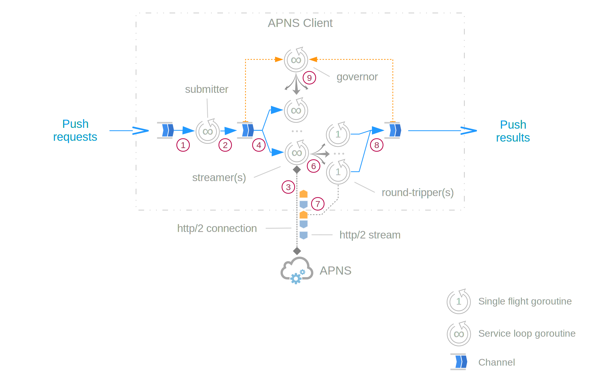

# Go APNS

:warning: **WORK IN PROGRESS** :warning:

Go APNS is a client for Apple Push Notification service over HTTP/2 protocol done "the Go way".

[](https://travis-ci.org/baobabus/go-apns)
[](https://godoc.org/github.com/baobabus/go-apns/apns2)

## Features

- Designed to communicate with Apple Push Notification service over HTTP/2 protocol
- Processes push requests asynchronously: just write your requests to a channel
- Notifies about push results asynchronously: just receive on the callback channel
- Automatically scales up processing pipeline as the load increases
- Allows full control of the scaling process and connection handling
- Effects back pressure as needed to ensure full awareness by the up-stream 
- Supports Go 1.7 and later

## Processing Flow

Each APNS Client handles all aspects of communication with APN service, including
management of HTTP/2 connections and controlling concurrent HTTP/2 streams.



<p align="center" style="color: #888"><i>(Control channels and service goroutines are not shown)</i></p>

1. `Submitter` picks up push requests from the processing queue
2. `Submitter` forwards requests to internal dispatch channel
3. Each `streamer` maintains a single HTTP/2 connection to APN service
4. One of the `streamers` picks up a push request from the dispatch queue
5. The `streamer` allocates a stream in its HTTP/2 connection
6. The `streamer` spins up a single-flight `round-tripper` goroutine
7. The `round-tripper` synchronously POSTs a request to APN service over
its streamer's HTTP/2 connection
8. APN server's response is written to the callback channel
9. `Governor` collects metrics for dispatch and callback channel blockages,
evaluates processing throughput and spins up new streamers as needed

## Configuration Settings and Customization

ConnsCfg example:

```go
ConnsCfg{
	DialTimeout:          1 * time.Second,
	RequestTimeout:       2 * time.Second,
	KeepAlive:            10 * time.Hour,
	MaxConcurrentStreams: 500,
}
```

ProcCfg example:

```go
ProcCfg{
	MaxRetries:                0,
	RetryEval:                 nil,
	MinConns:                  1,
	MaxConns:                  100,
	MaxRate:                   100000 / funit.Second,
	MaxBandwidth:              10 * funit.Kilobit / funit.Second,
	Scale:                     apns2.Incremental(2),
	MinSustain:                2 * time.Second,
	PollInterval:              200 * time.Millisecond,
	SettlePeriod:              5 * time.Second,
	AllowHTTP2Incursion:       true,
	UsePreciseHTTP2Metrics:    false,
	HTTP2MetricsRefreshPeriod: 200 * time.Millisecond,
}
```

## License

The MIT License (MIT)

Copyright (c) 2017 Aleksey Blinov

Permission is hereby granted, free of charge, to any person obtaining a copy
of this software and associated documentation files (the "Software"), to deal
in the Software without restriction, including without limitation the rights
to use, copy, modify, merge, publish, distribute, sublicense, and/or sell
copies of the Software, and to permit persons to whom the Software is
furnished to do so, subject to the following conditions:

The above copyright notice and this permission notice shall be included in all
copies or substantial portions of the Software.

THE SOFTWARE IS PROVIDED "AS IS", WITHOUT WARRANTY OF ANY KIND, EXPRESS OR
IMPLIED, INCLUDING BUT NOT LIMITED TO THE WARRANTIES OF MERCHANTABILITY,
FITNESS FOR A PARTICULAR PURPOSE AND NONINFRINGEMENT. IN NO EVENT SHALL THE
AUTHORS OR COPYRIGHT HOLDERS BE LIABLE FOR ANY CLAIM, DAMAGES OR OTHER
LIABILITY, WHETHER IN AN ACTION OF CONTRACT, TORT OR OTHERWISE, ARISING FROM,
OUT OF OR IN CONNECTION WITH THE SOFTWARE OR THE USE OR OTHER DEALINGS IN THE
SOFTWARE.
